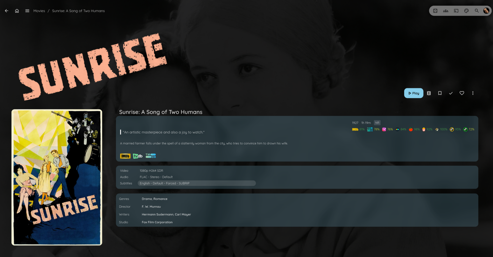
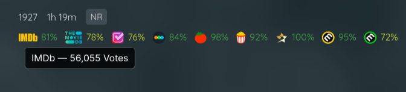

# Jellyfin Ratings

Add clean, clickable ratings to Jellyfin item pages (movies, shows, and anime) from popular sites. Configure everything from a small gear icon in the bottom‑right corner of the item page — no server restart needed.

---

## Features

* Adds rating badges to item pages with links back to the source.
* Optional colercoded ratings for better readability.
* Works for movies, series, and anime.
* Turn individual sources on/off.
* **Drag & drop** to reorder which ratings appear first (from the in‑app menu).
* Compact Mode for the Menu to better fit different screen sizes.
* Lightweight; loads only when needed in the web UI.

### Available rating sources

* IMDb
* TMDb
* Trakt
* Letterboxd
* Rotten Tomatoes (Critics)
* Rotten Tomatoes (Audience)
* Roger Ebert
* Metacritic (Critics)
* Metacritic (Users)
* AniList
* MyAnimeList

---

## Screenshots





## Requirements

* JavaScript Injector Plugin (required)
* MDBList API key (required)

---

## Quick start (JavaScript Injector)

1. Install the JavaScript‑injector Plugin for Jellyfin.
   [JavaScript Injector by n00bcodr](https://github.com/n00bcodr/Jellyfin-JavaScript-Injector)

3. Paste the contents of injector.js into the injector plugin:

   ```html
   /* ================= Jellyfin Ratings — Minimal Injector =================
      Paste into Jellyfin’s JS Injector.
      • Set your MDBList key below (client-side only; never in GitHub).
      • Open Settings by clicking any rating number or the parental rating.
   ============================================================================ */
   
   /* 0) Your MDBList API key (required) */
   const MDBLIST_KEY = 'YOUR-API-KEY-HERE';
   
   /* Expose key + mirror to localStorage (overrides any local key) */
   window.MDBL_KEYS = { MDBLIST: MDBLIST_KEY };
   try { localStorage.setItem('mdbl_keys', JSON.stringify(window.MDBL_KEYS)); } catch {}
   
   /* Loader — fetch your GitHub script (cache-busted) and run it */
   (async () => {
     const RAW_URL = 'https://raw.githubusercontent.com/xroguel1ke/jellyfin_ratings/refs/heads/main/ratings.js';
     try {
       const res = await fetch(`${RAW_URL}?t=${Date.now()}`, { cache: 'no-store', mode: 'cors' });
       if (!res.ok) throw new Error(`HTTP ${res.status}`);
       const code = await res.text();
       try { new Function(code)(); } catch { (0, eval)(code); } // fallback
     } catch (err) {
       console.error('[Jellyfin Ratings] loader failed:', err);
     }
   })();
   ```
4. Save and refresh Jellyfin in your browser

---

## Configure

1. Open any movie/series/anime item page in Jellyfin.
2. Click the rating **number** to open the Settings panel. Clicking a rating **icon** opens its source page (IMDb, TMDb, etc.).
3. Paste your **MDBList API Key** and **Save**.
4. Toggle the sources you want.
5. Use **drag & drop** in the menu to reorder how the ratings appear.

---

## Acknowledgments

Thanks to the Jellyfin community and the rating providers listed above.
